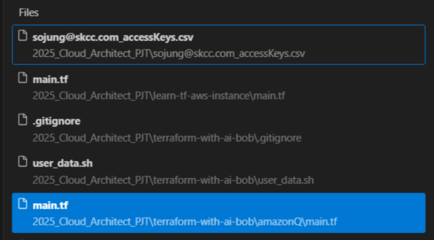

# Try 1

답변이 기존 코드를 참조하지 않는 듯하여 `@File > amazonQ/main.tf` 추가하고 질의 요청

### Prompt
> Write a Terraform script to create an AWS Target Group with the following configuration:
> * Target type: instance
> * Target group name: osj-terraform-with-{aq | cp}-target-group
> * Protocol and port: HTTP:80
> * VPC: osj-terraform-with-{aq | cp}-vpc
> * Register the following EC2 instances as targets (assumed to be created beforehand and their instance IDs available):
>   - osj-terraform-with-{aq | cp}-app-1
>   - osj-terraform-with-{aq | cp}-app-2


### Response
I'll help you add the Target Group configuration to your existing `main.tf` file. Based on your current file structure and naming conventions, here's how to add the Target Group configuration:

```hcl
#########################################
#                                       #
#            Target Group               #
#                                       #
#########################################

# Data source for existing EC2 instances
data "aws_instance" "apps" {
  for_each = local.instance_configs

  filter {
    name   = "tag:Name"
    values = ["${var.project_prefix}-${each.key}"]
  }

  depends_on = [aws_instance.app_instances]
}

# Target Group
resource "aws_lb_target_group" "app_tg" {
  name        = "${var.project_prefix}-target-group"
  port        = 80
  protocol    = "HTTP"
  target_type = "instance"
  vpc_id      = aws_vpc.main.id

  health_check {
    enabled             = true
    healthy_threshold   = 3
    interval           = 30
    matcher            = "200"
    path               = "/"
    port               = "traffic-port"
    protocol           = "HTTP"
    timeout            = 5
    unhealthy_threshold = 2
  }

  tags = {
    Name = "${var.project_prefix}-target-group"
  }

  lifecycle {
    create_before_destroy = true
  }
}

# Target Group Attachments
resource "aws_lb_target_group_attachment" "apps" {
  for_each = data.aws_instance.apps

  target_group_arn = aws_lb_target_group.app_tg.arn
  target_id        = each.value.id
  port             = 80

  depends_on = [aws_lb_target_group.app_tg]
}
```

This configuration:
1. Uses your existing local.instance_configs for consistency with your EC2 instance configuration
2. Creates a target group in the same VPC as your instances
3. Uses your existing project prefix variable for naming
4. Automatically registers both EC2 instances as targets
5. Sets up standard HTTP health checks
6. Uses proper dependencies to ensure resources are created in the correct order

The script will:
* Create a target group named like "osj-terraform-with-aq-target-group"
* Configure HTTP health checks on port 80
* Use the VPC you've already created
* Register both EC2 instances (app-1 and app-2) as targets
* Use consistent naming with your existing resources

Key features:
1. Reuses existing variables and locals
2. Maintains consistent naming convention
3. Uses for_each for efficient resource creation
4. Includes proper dependency management
5. Follows your existing file structure

The configuration integrates with your existing EC2 instances and VPC configuration, and uses the same variable structure you've already established in your `main.tf` file.

